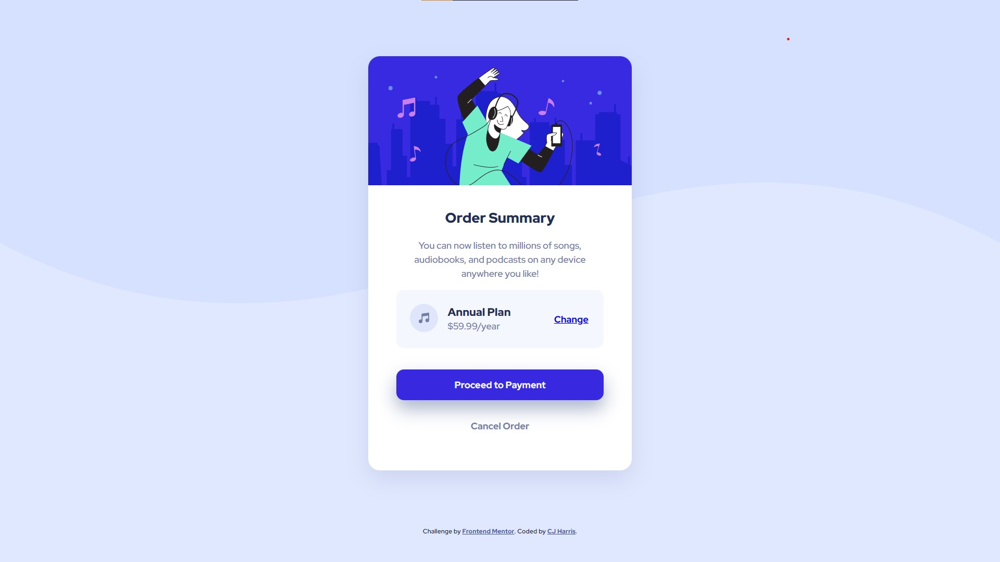

# Frontend Mentor - Order summary card solution

This is a solution to the [Order summary card challenge on Frontend Mentor](https://www.frontendmentor.io/challenges/order-summary-component-QlPmajDUj). Frontend Mentor challenges help you improve your coding skills by building realistic projects.

## Table of contents

- [Overview](#overview)
  - [The challenge](#the-challenge)
  - [Screenshot](#screenshot)
  - [Links](#links)
  - [Built with](#built-with)
  - [What I learned](#what-i-learned)
  - [Continued development](#continued-development)
  - [Useful resources](#useful-resources)
- [Author](#author)
- [Acknowledgments](#acknowledgments)

## Overview

### The challenge

Users should be able to:

- See hover states for interactive elements

### Screenshot

### Links

- Solution URL: [Add solution URL here](https://your-solution-url.com)
- Live Site URL: [https://caylemh.github.io/order-summary-component-main/](https://caylemh.github.io/order-summary-component-main/)

### Built with

- Semantic HTML5 markup
- CSS custom properties
- Flexbox
- CSS Grid
- Desktop-first workflow

### What I learned

I'm continuing to learn more about layouts and CSS centering & styles.

### Continued development

To perhaps incorporate some JS to add some functionality.

### Useful resources

- [Conquering Responsive Layouts](https://courses.kevinpowell.co/view/courses/conquering-responsive-layouts) - This helped me immensely, especially in understanding layouts and CSS tools.

## Author

- Frontend Mentor - [@caylemh](https://www.frontendmentor.io/profile/caylemh)

## Acknowledgments

Just want to say thank you Kevin Powell for his awesome resources.
